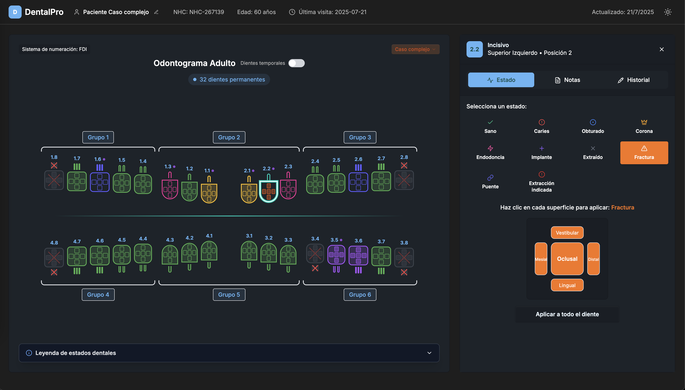
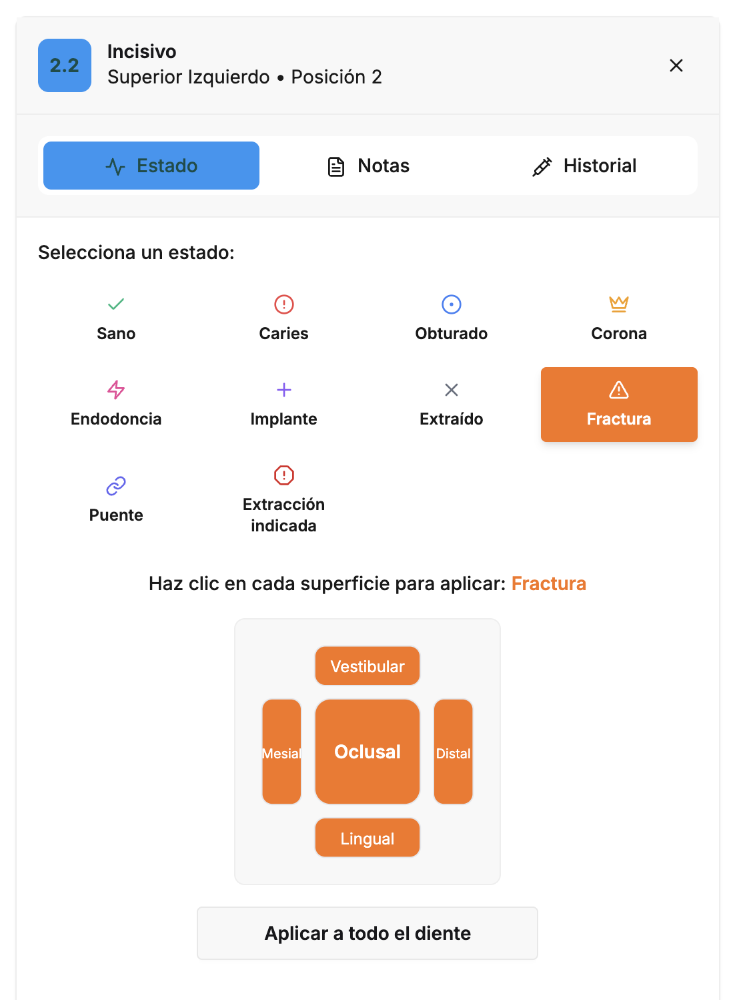

# OP Odontogram

Una librería de React para crear odontogramas dentales interactivos. Permite visualizar y gestionar el estado de 32 dientes permanentes y 20 dientes temporales con una interfaz intuitiva y personalizable.

## 🦷 Características


- **Visualización completa**: 32 dientes permanentes y 20 dientes temporales
- **Estados dentales**: 11 estados predefinidos incluyendo no erupcionado para casos pediátricos
- **Superficies dentales**: Control individual de 5 superficies por diente
- **Animaciones**: Efecto de mordida y transiciones suaves
- **Casos clínicos**: Ejemplos predefinidos para demostración
- **Sistema FDI**: Numeración internacional estándar
- **Propiedades periodontales**: Movilidad, furca, recesión gingival
- **TypeScript**: Totalmente tipado para mejor DX
- **Personalizable**: CSS y temas adaptables
- **Dependencias mínimas**: React y Lucide React (iconos)

## 📦 Instalación

```bash
npm install op-odontogram
```

o

```bash
yarn add op-odontogram
```

## 🚀 Uso Básico

```jsx
import React, { useState } from "react";
import {
  Odontogram,
  initialPermanentTeeth,
  initialTemporaryTeeth,
} from "op-odontogram";
import "op-odontogram/styles/odontogram.css";

function App() {
  const [teeth, setTeeth] = useState(initialPermanentTeeth);
  const [temporaryTeeth, setTemporaryTeeth] = useState(initialTemporaryTeeth);
  const [selectedTooth, setSelectedTooth] = useState(null);

  const handleToothClick = (tooth) => {
    setSelectedTooth(tooth);
    console.log("Diente seleccionado:", tooth);
  };

  return (
    <div style={{ height: "600px" }}>
      <Odontogram
        teeth={teeth}
        temporaryTeeth={temporaryTeeth}
        showTemporaryTeeth={true}
        selectedTooth={selectedTooth}
        onToothClick={handleToothClick}
      />
    </div>
  );
}
```

## 📋 Props del Componente

### Odontogram



| Prop                     | Tipo                       | Por Defecto | Descripción                                |
| ------------------------ | -------------------------- | ----------- | ------------------------------------------ |
| `teeth`                  | `Tooth[]`                  | requerido   | Array de dientes permanentes               |
| `temporaryTeeth`         | `Tooth[]`                  | requerido   | Array de dientes temporales                |
| `showTemporaryTeeth`     | `boolean`                  | requerido   | Mostrar/ocultar dientes temporales         |
| `onToggleTemporaryTeeth` | `(show: boolean) => void`  | requerido   | Callback para toggle de dientes temporales |
| `selectedTooth`          | `Tooth \| null`            | requerido   | Diente actualmente seleccionado            |
| `onToothClick`           | `(tooth: Tooth) => void`   | requerido   | Callback al hacer clic en un diente        |
| `showBiteEffect`         | `boolean`                  | requerido   | Mostrar efecto de mordida                  |
| `onToggleBiteEffect`     | `(show: boolean) => void`  | requerido   | Toggle efecto de mordida                   |
| `isAnimatingBite`        | `boolean`                  | requerido   | Estado de animación de mordida             |
| `onSimulateBite`         | `() => void`               | requerido   | Simular animación de mordida               |
| `selectedCaseId`         | `string`                   | opcional    | ID del caso clínico seleccionado           |
| `onCaseSelect`           | `(caseId: string) => void` | opcional    | Callback para selección de caso            |

## 🦷 Estructura del Tipo Tooth



```typescript
interface Tooth {
  // Identificación
  id: number; // ID único (ej: 11 para diente 1.1)
  clinicalId?: string; // Notación FDI: "1.8", "2.1", etc.

  // Ubicación
  quadrant: 1 | 2 | 3 | 4; // Cuadrante dental
  position: number; // Posición en el cuadrante (1-8)

  // Estado clínico
  status: ToothStatus; // Estado actual del diente
  notes?: string; // Notas clínicas
  isTemporary?: boolean; // Si es diente temporal

  // Propiedades anatómicas
  toothType?: "incisor" | "canine" | "premolar" | "molar";
  rootCount?: 1 | 2 | 3;
  rootType?: "single" | "bifurcated" | "trifurcated";

  // Propiedades periodontales
  mobilityGrade?: 0 | 1 | 2 | 3; // Grado de movilidad
  furcationGrade?: 0 | 1 | 2 | 3; // Afectación de furca
  gingivalRecession?: number; // Recesión en mm
  pocketDepth?: number; // Profundidad de bolsa en mm

  // Superficies dentales
  surfaces?: {
    oclusal?: ToothStatus; // Superficie masticatoria
    vestibular?: ToothStatus; // Hacia labio/mejilla
    lingual?: ToothStatus; // Hacia lengua
    mesial?: ToothStatus; // Hacia línea media
    distal?: ToothStatus; // Alejada de línea media
  };

  // Metadatos
  lastUpdate?: string; // Fecha última actualización
  procedures?: ToothProcedure[]; // Historial de procedimientos
}

type ToothStatus =
  | "healthy" // Sano
  | "caries" // Caries activa
  | "filled" // Obturado
  | "crown" // Corona protésica
  | "extracted" // Extraído
  | "implant" // Implante dental
  | "root_canal" // Endodoncia
  | "fracture" // Fracturado
  | "bridge" // Puente
  | "extraction_indicated" // Indicado para extracción
  | "not_erupted"; // No erupcionado
```

## 🎨 Personalización de Estilos

La librería incluye un archivo CSS con estilos predeterminados. Puedes sobrescribir estos estilos usando las siguientes clases:


```css
/* Contenedor principal */
.odontogram-container {
}

/* Estados de los dientes */
.tooth-status-healthy {
}
.tooth-status-caries {
}
.tooth-status-filled {
}
/* ... otros estados */

/* Diente seleccionado */
.tooth-selected {
}

/* Dientes temporales */
.tooth-temporary {
}

/* Superficies dentales */
.tooth-surface-oclusal {
}
.tooth-surface-vestibular {
}
/* ... otras superficies */
```

## 🚀 Funcionalidades Avanzadas

### Animación de Mordida

```jsx
function OdontogramWithBite() {
  const [showBiteEffect, setShowBiteEffect] = useState(false);
  const [isAnimatingBite, setIsAnimatingBite] = useState(false);

  const simulateBite = () => {
    if (isAnimatingBite) return;

    setIsAnimatingBite(true);
    setShowBiteEffect(false); // Cerrar

    setTimeout(() => {
      setShowBiteEffect(true); // Abrir
    }, 300);

    setTimeout(() => {
      setShowBiteEffect(false); // Morder
    }, 1000);

    setTimeout(() => {
      setIsAnimatingBite(false);
    }, 1500);
  };

  return (
    <Odontogram
      teeth={teeth}
      temporaryTeeth={temporaryTeeth}
      showBiteEffect={showBiteEffect}
      onToggleBiteEffect={setShowBiteEffect}
      isAnimatingBite={isAnimatingBite}
      onSimulateBite={simulateBite}
      // ... otras props
    />
  );
}
```

### Casos Clínicos Predefinidos

```jsx
import { getClinicalCaseById } from "op-odontogram";

function OdontogramWithCases() {
  const [selectedCaseId, setSelectedCaseId] = useState("empty");

  const handleCaseSelect = (caseId) => {
    const clinicalCase = getClinicalCaseById(caseId);
    if (clinicalCase) {
      // Aplicar el caso clínico
      setTeeth(clinicalCase.permanentTeeth);
      setTemporaryTeeth(clinicalCase.temporaryTeeth);
    }
  };

  return (
    <Odontogram
      selectedCaseId={selectedCaseId}
      onCaseSelect={handleCaseSelect}
      // ... otras props
    />
  );
}

// Casos disponibles:
// - 'empty': Por defecto
// - 'basic': Caso básico adulto
// - 'periodontal': Enfermedad periodontal
// - 'complex': Múltiples tratamientos
// - 'orthodontic': Ortodoncia activa
// - 'pediatric': Dentición mixta (6-8 años)
// - 'infant': Solo temporales (3-5 años)
```

### Superficies Dentales

```jsx
function updateToothSurface(tooth, surface, status) {
  return {
    ...tooth,
    surfaces: {
      ...tooth.surfaces,
      [surface]: status,
    },
  };
}

// Ejemplo de uso
const updatedTooth = updateToothSurface(tooth, "oclusal", "caries");
```

### Propiedades Periodontales

```jsx
function PeriodontalExam() {
  const [teeth, setTeeth] = useState(initialTeeth);

  const updatePeriodontalData = (toothId, data) => {
    setTeeth(
      teeth.map((tooth) =>
        tooth.id === toothId
          ? {
              ...tooth,
              mobilityGrade: data.mobility,
              furcationGrade: data.furcation,
              gingivalRecession: data.recession,
              pocketDepth: data.pocket,
            }
          : tooth
      )
    );
  };

  return (
    <>
      <Odontogram teeth={teeth} /* ... */ />

      {selectedTooth && (
        <PeriodontalForm
          tooth={selectedTooth}
          onUpdate={(data) => updatePeriodontalData(selectedTooth.id, data)}
        />
      )}
    </>
  );
}
```

## 💡 Ejemplo Avanzado

```jsx
import React, { useState } from "react";
import {
  Odontogram,
  initialPermanentTeeth,
  initialTemporaryTeeth,
  ToothStatus,
} from "op-odontogram";

function DentalChart() {
  const [teeth, setTeeth] = useState(initialPermanentTeeth);
  const [selectedTooth, setSelectedTooth] = useState(null);
  const [currentTool, setCurrentTool] = useState < ToothStatus > "healthy";

  const handleToothClick = (tooth) => {
    // Actualizar el estado del diente con la herramienta actual
    const updatedTeeth = teeth.map((t) =>
      t.id === tooth.id ? { ...t, status: currentTool } : t
    );
    setTeeth(updatedTeeth);
    setSelectedTooth(tooth);
  };

  const tools = [
    { status: "healthy", label: "Sano", color: "#10b981" },
    { status: "caries", label: "Caries", color: "#ef4444" },
    { status: "filled", label: "Obturado", color: "#3b82f6" },
    { status: "crown", label: "Corona", color: "#f59e0b" },
    { status: "extracted", label: "Extraído", color: "#6b7280" },
  ];

  return (
    <div>
      {/* Barra de herramientas */}
      <div style={{ marginBottom: "20px" }}>
        {tools.map((tool) => (
          <button
            key={tool.status}
            onClick={() => setCurrentTool(tool.status)}
            style={{
              backgroundColor:
                tool.status === currentTool ? tool.color : "#e5e7eb",
              color: tool.status === currentTool ? "white" : "black",
              padding: "8px 16px",
              margin: "0 4px",
              border: "none",
              borderRadius: "4px",
              cursor: "pointer",
            }}
          >
            {tool.label}
          </button>
        ))}
      </div>

      {/* Odontograma */}
      <div style={{ height: "600px" }}>
        <Odontogram
          teeth={teeth}
          selectedTooth={selectedTooth}
          onToothClick={handleToothClick}
        />
      </div>

      {/* Información del diente seleccionado */}
      {selectedTooth && (
        <div
          style={{
            marginTop: "20px",
            padding: "16px",
            backgroundColor: "#f3f4f6",
          }}
        >
          <h3>Diente {selectedTooth.clinicalId}</h3>
          <p>Estado: {selectedTooth.status}</p>
          <p>Cuadrante: {selectedTooth.quadrant}</p>
          <p>Posición: {selectedTooth.position}</p>
        </div>
      )}
    </div>
  );
}
```

## 🔧 Utilidades y Exports Disponibles

```javascript
import {
  // Componentes
  Odontogram,
  DetailedToothComponent,

  // Tipos
  Tooth,
  ToothStatus,
  ToothProcedure,
  ToothSurface,
  ToothRenderProps,
  OdontogramProps,

  // Datos iniciales
  initialPermanentTeeth,
  initialTemporaryTeeth,

  // Constantes
  TOOTH_TYPES,
  TOOTH_GROUPS,

  // Utilidades
  createTooth,

  // Configuración de layout
  toothLayoutConfig,
  getToothVerticalOffset,

  // Casos clínicos (próximamente)
  // clinicalCases,
  // getClinicalCaseById,
  // getClinicalCasesByCategory
} from "op-odontogram";

// Crear un nuevo diente
const newTooth = createTooth(11, 1, 1, {
  status: "caries",
  notes: "Caries oclusal",
});

// Obtener el nombre del tipo de diente
const toothName = TOOTH_TYPES.PERMANENT[1]; // "Incisivo central"

// Obtener offset vertical de un diente
const offset = getToothVerticalOffset(11); // 20
```

## ⚠️ Nota de Migración

Si estás actualizando desde una versión anterior:

1. **verticalOffset** ha sido removido de la interfaz Tooth
2. Los valores de posicionamiento ahora están en `toothLayoutConfig`
3. El estado `not_erupted` ha sido agregado para casos pediátricos
4. Nuevas props requeridas en Odontogram (ver tabla de props)

## 📝 Licencia

MIT © Pedro Hernández Letelier

## 🙏 Atribución

Si usas esta librería en tu proyecto, se agradece (pero no es obligatorio) incluir una referencia:

```
Odontograma creado con op-odontogram
https://github.com/pedroinformatico/op-odontorgram
```

## 🤝 Contribuciones

Las contribuciones son bienvenidas. Por favor:

1. Fork el proyecto
2. Crea tu rama de características (`git checkout -b feature/AmazingFeature`)
3. Commit tus cambios (`git commit -m 'Add some AmazingFeature'`)
4. Push a la rama (`git push origin feature/AmazingFeature`)
5. Abre un Pull Request

## 🐛 Reportar Problemas

Si encuentras algún problema, por favor abre un issue en GitHub describiendo:

- El comportamiento esperado
- El comportamiento actual
- Pasos para reproducir el problema
- Tu entorno (versión de React, navegador, etc.)

## 📧 Contacto

Pedro Hernández Letelier - [@tu-twitter](https://twitter.com/tu-twitter)

Link del Proyecto: [https://github.com/pedroinformatico/op-odontorgram](https://github.com/pedroinformatico/op-odontorgram)
