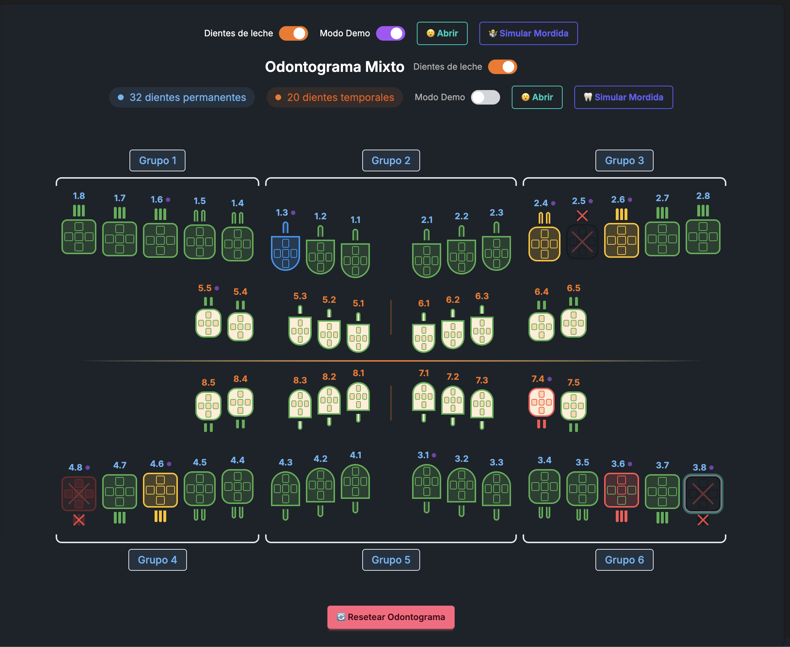
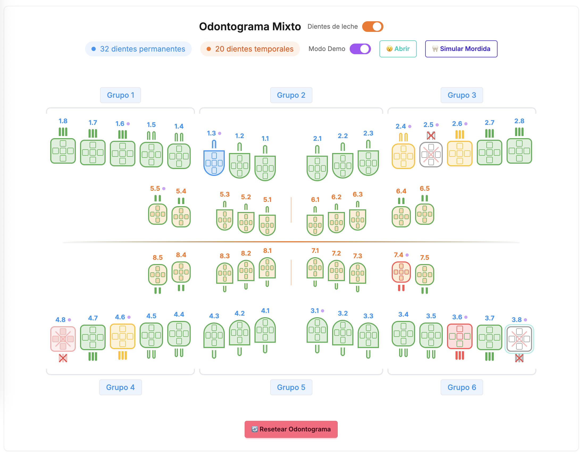

# OP Odontogram



[](LICENSE)
[](https://reactjs.org/)
[](https://www.typescriptlang.org/)
[](https://vitejs.dev/)

## Descripción

**OP Odontogram** es una librería de React para crear odontogramas dentales interactivos. Permite visualizar y gestionar el estado de dientes permanentes y temporales con una interfaz moderna e intuitiva.

## Características

- 🦷 **32 dientes permanentes y 20 temporales** - Soporte completo para dentición mixta
- 🎨 **Estados personalizables** - Caries, obturaciones, coronas, extracciones y más
- 🌊 **Animaciones fluidas** - Efectos de mordida y transiciones suaves
- 📱 **Responsive** - Se adapta a diferentes tamaños de pantalla
- 💾 **Persistencia local** - Guarda automáticamente los cambios
- 🏴‍☠️ **Open Source** - Completamente libre y gratuito

## Instalación

### Como aplicación demo

```bash
# Clonar el repositorio
git clone https://github.com/pedroinformatico/op-odontorgram.git

# Navegar al directorio
cd op-odontogram

# Instalar dependencias
npm install

# Iniciar el servidor de desarrollo
npm run dev
```

### Como librería npm

```bash
npm install op-odontogram
```

## Uso Básico

```jsx
import { Odontogram } from 'op-odontogram';
import 'op-odontogram/styles/odontogram.css';

function App() {
  return (
    <Odontogram
      teeth={teeth}
      onToothClick={(tooth) => console.log('Diente seleccionado:', tooth)}
    />
  );
}
```

## Demo Interactiva



La aplicación incluye:

- 🎮 **Modo Demo** - Ejemplos de diferentes estados dentales
- 🦷 **Animación de mordida** - Visualización del movimiento dental
- 📊 **Panel de detalles** - Información completa de cada diente
- 🔧 **Herramientas de estado** - Gestión completa del estado dental

## Contribuir

¡Las contribuciones son bienvenidas! Para contribuir:

1. **Fork** el proyecto
2. Crea tu **Feature Branch** (`git checkout -b feature/nueva-funcionalidad`)
3. **Commit** tus cambios (`git commit -m 'Add: nueva funcionalidad'`)
4. **Push** a la rama (`git push origin feature/nueva-funcionalidad`)
5. Abre un **Pull Request**

### ¿Necesitas ayuda?

- 📖 [Documentación completa](README-LIBRARY.md)
- 🐛 [Reportar problemas](https://github.com/pedroinformatico/op-odontorgram/issues)
- 💬 [Discusiones](https://github.com/pedroinformatico/op-odontorgram/discussions)

## Colaboradores

¿Quieres ser parte de este proyecto? ¡Todos los nakamas son bienvenidos a la travesía!

- 💻 **Desarrolladores** - Mejoras en funcionalidad y rendimiento
- 🎨 **Diseñadores** - Interfaz y experiencia de usuario
- 📚 **Documentadores** - Guías y tutoriales
- 🔬 **Testers** - Pruebas y control de calidad

## Licencia

Este proyecto está bajo la Licencia MIT - ve el archivo [LICENSE](LICENSE) para más detalles.

## Tecnologías

- React 18.3
- TypeScript
- Tailwind CSS
- DaisyUI
- Vite
- Lucide React

---

**Nota:** *Si tienes cualquier problema con los dientes, solo toma leche* 🥛
